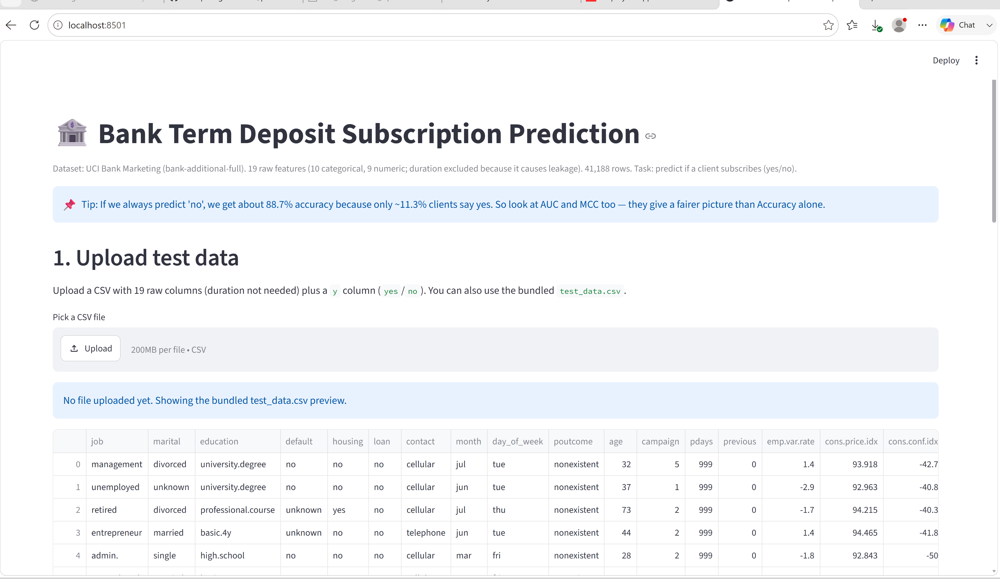
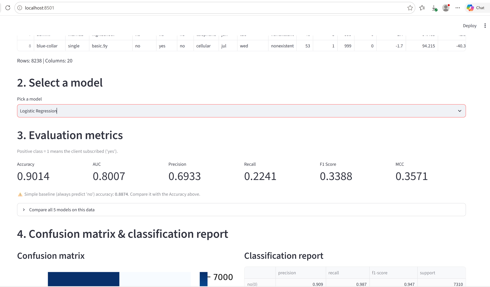

# Bank Term Deposit Subscription Prediction

This is my second assignment for the Machine Learning course in BITS Pilani WILP (M.Tech AI/ML). In this project, I built and compared five classification models to predict whether a bank customer will subscribe to a term deposit. I also made a Streamlit app where you can upload test data and check how each model performs.

## a. Problem Statement

A Portuguese bank runs phone marketing campaigns to sell term deposits. The goal is to predict whether a client will subscribe to a term deposit **before** the call is made, using 19 pre-call attributes. The results are compared through an interactive Streamlit app.

## b. Dataset Description

- **Original UCI file:** `bank-additional-full.csv`
- **Local file in repo:** `bank_marketing_raw.csv` (same data, renamed for clarity)
- **Source:** UCI Machine Learning Repository, dataset id 222 (Moro, Rita & Cortez, 2014)
- **Instances:** 41,188
- **Input features:** 19 in total — 10 categorical (job, marital, education, default, housing, loan, contact, month, day_of_week, poutcome) and 9 numeric (age, campaign, pdays, previous, emp.var.rate, cons.price.idx, cons.conf.idx, euribor3m, nr.employed)
- **Excluded column:** `duration` is not used because it is only known after the call ends; using it would cause data leakage
- **Target:** `y` — `yes` means subscribed (mapped to 1), `no` means not subscribed (mapped to 0)
- **Class balance:** 36,548 no / 4,640 yes (about 88.7% / 11.3%)
- **Train/test split:** 80% train / 20% test, stratified, `random_state=42`

## c. GitHub Repository Link

https://github.com/prabhatkumardubey/bank-marketing-ml-model-test

## d. Models Used

Five classification models were trained and compared on the same 80/20 stratified split:

1. **Logistic Regression**
2. **Decision Tree** (`max_depth=8`)
3. **kNN** (k-Nearest Neighbors, `k=15`)
4. **Naive Bayes**
5. **Random Forest (Ensemble)** (`200` trees, `max_depth=10`)

Logistic Regression and kNN used standardized numeric features. The other models used the original numeric features.

### Comparison Table

*(Precision, Recall and F1 are calculated for the positive class `1 = yes/subscribed`.)*

| Model | Accuracy | AUC | Precision | Recall | F1 | MCC |
| --- | :-: | :-: | :-: | :-: | :-: | :-: |
| Logistic Regression | 0.9014 | 0.8007 | 0.6933 | 0.2241 | 0.3388 | 0.3571 |
| Decision Tree | 0.8995 | 0.7864 | 0.6263 | 0.2672 | 0.3746 | 0.3651 |
| kNN | 0.8991 | 0.7745 | 0.6293 | 0.2543 | 0.3622 | 0.3569 |
| Naive Bayes | 0.8694 | 0.7730 | 0.4237 | 0.4429 | 0.4331 | 0.3594 |
| Random Forest (Ensemble) | 0.9022 | 0.8089 | 0.7075 | 0.2241 | 0.3404 | 0.3619 |

*Baseline: always predicting "no" gives 0.8873 accuracy and 0.0 for all other metrics. Every model beats it on AUC and MCC, but only slightly on accuracy.*

### Observations

- **Logistic Regression:** Accuracy barely clears the "always no" baseline. MCC (0.3571) and AUC (0.8007) show it learned something, but it misses about 3 out of 4 real subscribers (Recall 0.2241).
- **Decision Tree:** Best MCC (0.3651) among all models, despite a lower AUC than Random Forest. This shows MCC and AUC can rank models differently.
- **kNN:** Average results. With 52 one-hot encoded columns, Euclidean distance does not work very well because the data becomes sparse.
- **Naive Bayes:** Lowest accuracy and precision, but best recall (0.4429). It catches more real subscribers but also produces more false alarms.
- **Random Forest (Ensemble):** Best accuracy, best AUC and best precision. It is the strongest overall, but its recall is tied for lowest, so it is conservative.

**Overall winner:** **Random Forest (Ensemble)** is the best overall because it wins on 3 out of 6 metrics, including AUC, which is less affected by class imbalance. If the bank wants to catch as many real subscribers as possible (even if it means more wasted calls), then **Naive Bayes** is a better choice.

## Live Demo

The app is deployed and publicly accessible at:

[https://bank-marketing-ml-model-test-m36udrh4unyv9wlpyfmbdv.streamlit.app/](https://bank-marketing-ml-model-test-m36udrh4unyv9wlpyfmbdv.streamlit.app/)

### Screenshots

**App UI — Dataset summary and test data upload/preview**  

**App UI — Model selection, metrics, confusion matrix and classification report**  

## Author

**Prabhat Kumar Dubey**  
BITS Pilani WILP — M.Tech (AI/ML)  
Machine Learning — Assignment 2
